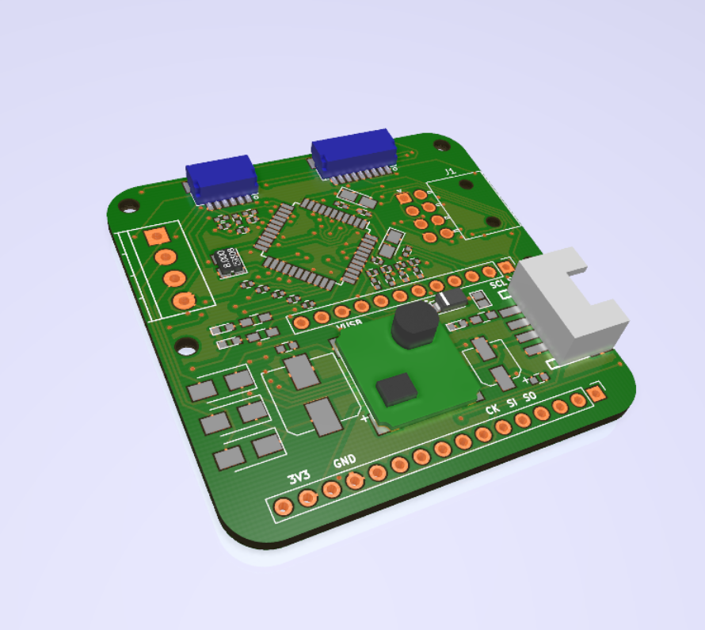
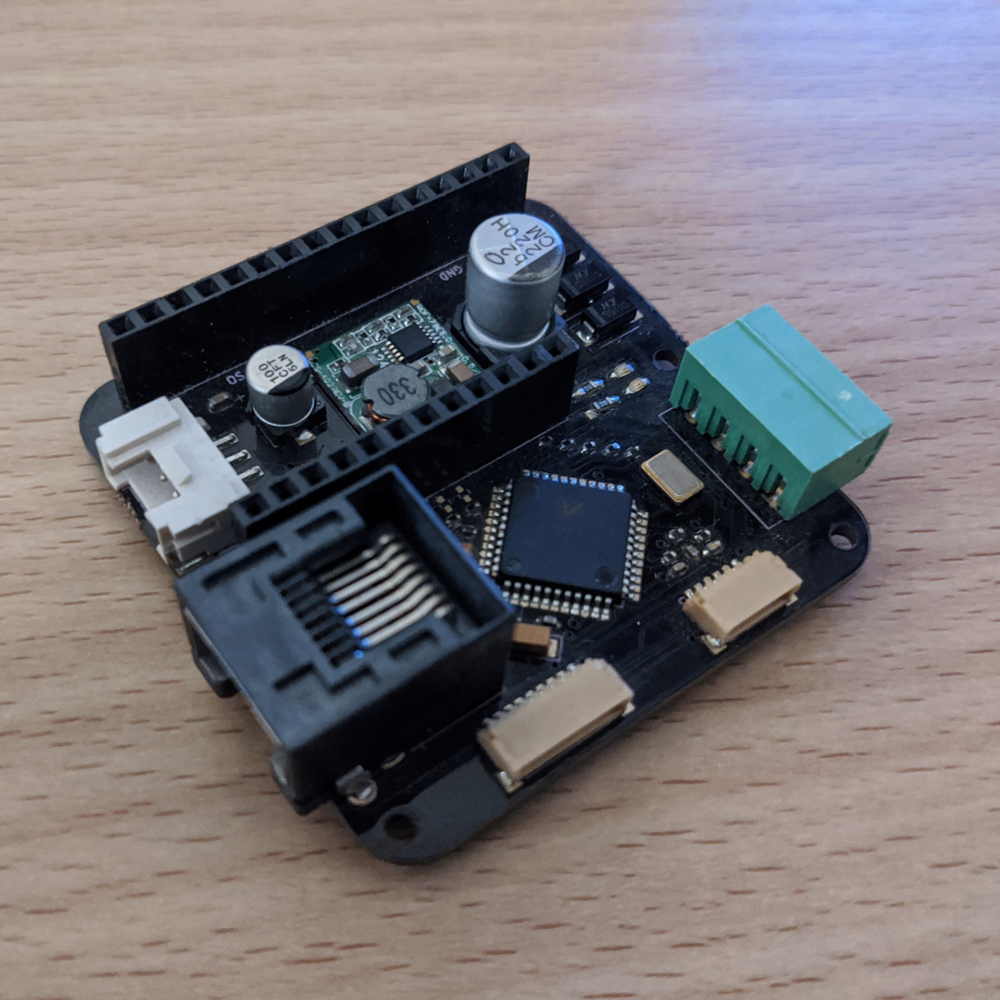

# V9203 FeatherWing Devkit
An evaluation board for Vangotech V9203 3-phase energy monitor in a
Featherwing format. It has been tested with Arduino enabled feathers
and should work with any Arduino platform with an SPI bus.

The SPI bus is 3.3v and exposed via the Feather headers and the JST
connector on the top for people wishing to use it with non-feather
format boards as host processor.

The board can be obtained on:

- [Tindie](https://www.tindie.com/products/whatnick/v9203-featherwing/)
- [OSHPark](https://oshpark.com/shared_projects/62lfzmN7)
- [Aisler](https://aisler.net/p/OBAOETDS)
- [PCBWay](https://www.pcbway.com/project/shareproject/V9203_Devkit_Featherwing.html)
  
## Board Images

### Rendered

**Top Render**

**Bottom Render**

### Assembled (with RJ45)

## Arduino Firmware
Arduino Firmware if available in [GitHub](https://github.com/whatnick/V9203_Arduino).

## Micropython Firmware
WIP